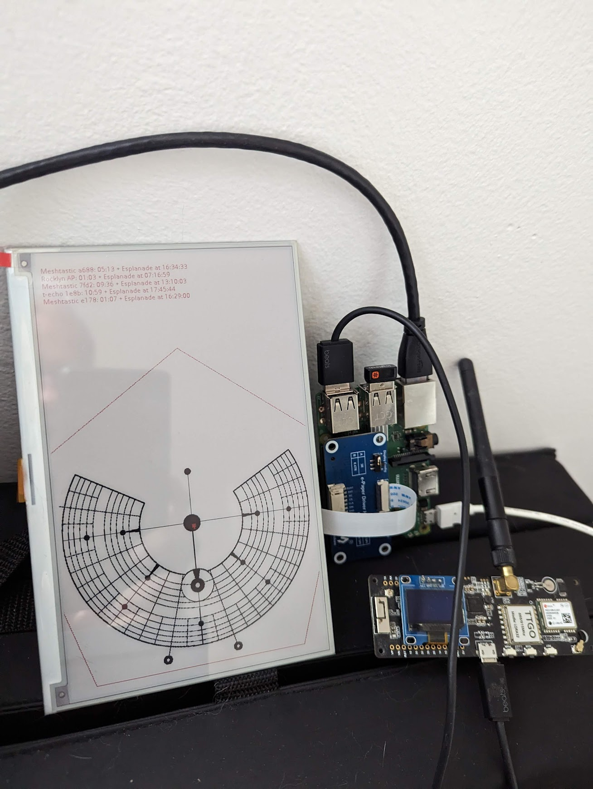

# BRC Meshtastic ePaper Map

Display Meshtastic camp locations on a calibrated Black Rock City map using a
WaveShare 7.3-inch E6/Spectra 6 e-paper panel. The application converts GPS
coordinates shared on Meshtastic channel 1 into playa addresses, assigns
stable symbols, records position and chat history in SQLite, and provides
browser tools for symbol preferences and map calibration.



## Contents

- [What it does](#what-it-does)
- [Hardware and software](#hardware-and-software)
- [Quick start](#quick-start)
- [Raspberry Pi installation](#raspberry-pi-installation)
- [Running the map](#running-the-map)
- [Display behavior](#display-behavior)
- [Channel 1 locations and emoji](#channel-1-locations-and-emoji)
- [Position and conversation history](#position-and-conversation-history)
- [GPS, playa addresses, and projection](#gps-playa-addresses-and-projection)
- [Map calibration](#map-calibration)
- [Mockup and hardware tests](#mockup-and-hardware-tests)
- [Configuration reference](#configuration-reference)
- [Command reference](#command-reference)
- [Architecture and files](#architecture-and-files)
- [Web APIs](#web-apis)
- [Maintenance and data safety](#maintenance-and-data-safety)
- [Troubleshooting](#troubleshooting)
- [Development](#development)
- [Map assets and GIS data](#map-assets-and-gis-data)

## What it does

The main process:

1. Loads the static BRC map and immediately displays it with an update time.
2. Starts the optional emoji-preference server on port `8051` unless disabled.
3. Connects to a Meshtastic radio over serial. If the serial constructor does
   not produce a usable node database, it tries Meshtastic TCP on `localhost`.
4. Listens for live position packets on Meshtastic channel 1 and ignores
   positions received on other channels.
5. Converts each Channel 1 GPS position to a BRC address and screen position.
6. Saves Channel 1 position history to SQLite.
7. Shows every Channel 1 location; `friends.json` never filters visibility.
8. Refreshes the e-paper when nodes join or leave, an emoji changes, or a
   displayed node moves at least `min_distance_refresh_ft`.
9. Saves received Meshtastic text packets to SQLite as they arrive.

Key features include:

- GPS to clock-and-street, distance, and trash-fence addresses such as
  `09:30+B`, `11:15, 4200ft from Man`, or `11:30+Trash Fence`.
- Anchor-based GPS-to-screen calibration.
- Channel 1 camp-location filtering following the Burning Mesh camp setup.
- Matching, stable e-paper-safe symbols in the list and on the map.
- A searchable optional emoji-preference web UI with no display allowlist.
- A 15-person GPS-first mockup covering the area near the Man, every street
  ring, the non-city area beyond Temple, and the trash fence.
- SQLite position and conversation history with CSV exports.
- Serial connection retry with local TCP fallback and exponential backoff.
- A native driver for the WaveShare 7.3-inch E6/Spectra 6 display.

## Hardware and software

### Supported display

This project targets the WaveShare 7.3-inch E6/Spectra 6 full-color
PhotoPainter panel:

- Physical panel buffer: `800 × 480`.
- Application canvas: `480 × 800` portrait; the driver rotates it for the
  physical panel.
- The driver supports black, white, red, blue, green, and yellow. Text and
  burner icons deliberately use only black, red, blue, and green because
  yellow has poor contrast on the panel.
- Driver: `waveshare_epd/epd7in3e.py`.

Do not use `epd7in5_V2.py` for this panel. That is a different display family
and was the cause of the earlier `epdconfig.SPI` failure.

### Raspberry Pi and radio

- Raspberry Pi Zero 2 W, Pi 3, or Pi 4.
- A Meshtastic device connected by USB serial, or a Meshtastic TCP service on
  the Pi at `localhost`.
- SPI enabled for the e-paper HAT.

Default BCM pin assignments are:

| Function | BCM pin |
| --- | ---: |
| Reset | 17 |
| Data/command | 25 |
| Chip select | 8 |
| Busy | 24 |
| Panel power | 27 |

The SPI device is bus `0`, chip select `0`, mode `0`, at 4 MHz.

### Software

- Python 3.10 or newer. The package metadata currently declares 3.9, but the
  source uses modern union type syntax that requires Python 3.10+.
- GNU Make.
- On Raspberry Pi: system `RPi.GPIO` and `spidev` packages.
- A desktop image viewer is needed only for `--screen` previews.

## Quick start

For a laptop or development machine:

```bash
git clone <repository-url>
cd BRC-Meshtastic-ePaper-Map
make install
make pytest
make test-full-mockup
```

`make install` is the only laptop installation target. It creates `.venv`,
upgrades the packaging tools, and installs this project in editable mode with
its test dependencies. Other Make targets never install dependencies for you.

The mockup saves `/tmp/brc-full-mockup.png` and opens it with the system image
viewer. It does not require a radio or e-paper panel.

## Raspberry Pi installation

On Raspberry Pi OS, first install the platform packages needed to create a
virtual environment and access GPIO/SPI. Package names may vary on non-Debian
distributions.

```bash
sudo apt update
sudo apt install -y git python3-venv python3-rpi.gpio python3-spidev
```

Enable SPI:

```bash
sudo raspi-config
# Interface Options → SPI → Enable
```

Clone and install:

```bash
git clone <repository-url>
cd BRC-Meshtastic-ePaper-Map
make install-pi
make test-screen
```

`make install-pi` is the only Raspberry Pi installation target. It recreates
the virtual environment with access to system site packages, then installs the
project and development dependencies in editable mode.

If serial access is denied, add the login user to the serial-device group and
start a new login session:

```bash
sudo usermod -aG dialout "$USER"
```

## Running the map

Start the production e-paper process from the project root:

```bash
make run-map
```

Stop it with `Ctrl+C`. The application unsubscribes from Meshtastic events,
closes the radio and SQLite database, puts the display to sleep, and releases
GPIO/SPI resources.

Direct invocation is also supported:

```bash
.venv/bin/python display_map.py [options]
```

| Option | Behavior |
| --- | --- |
| `-d`, `--debug` | Draw fixed calibration landmarks instead of connecting to Meshtastic. |
| `-s`, `--screen` | Open frames with the desktop image viewer instead of initializing e-paper. |
| `-c`, `--calibrate` | Accepted by the CLI; calibration is performed by `make calibrate`. |
| `--no-friends` | Disable the optional friend/emoji server and stored emoji overrides; Channel 1 visibility is unchanged. |

The initial base map is sent to the display before radio discovery. A missing
radio therefore does not leave the panel blank while connection retries run.

### Meshtastic connection behavior

The application first creates a Meshtastic `SerialInterface`. If that object
has no node database, it explicitly tries `TCPInterface("localhost")`.
Initial connection failures retry after 5, 10, 20, 40, 80, and then a maximum
of 120 seconds. There is currently no command-line option for a remote TCP
hostname.

## Display behavior

Each rendered frame contains:

- A compact detail list at the top with symbol, Meshtastic long name, BRC
  address, and an `@ HH:MM` node-position timestamp.
- The city map and dotted trash-fence outline.
- A colored circular symbol marker at each projected location.
- `updated: YYYY-MM-DD HH:MM:SS` in the bottom-right corner, using the Pi's
  local system time when the frame was composed.

The list switches to a denser 10-point layout above 10 people. Marker and list
colors rotate through the supplied E6-safe palette. The live display normally
uses red; the full mockup uses red, blue, green, and black.

E-paper is refreshed only when the displayed set changes, an assigned emoji
changes, or someone moves at least the configured distance. SQLite history is
independent of this decision and can accept new position reports without an
e-paper refresh.

## Channel 1 locations and emoji

The e-paper displays every live location packet received on zero-based
Meshtastic channel index `1`. It does not use the merged NodeDB position for
visibility because NodeDB does not retain the channel that supplied a position.
Consequently, a node first appears after its next live Channel 1 position
broadcast following application startup.

This matches the recommended setup in the
[Burning Mesh camp channel and location-sharing guide](https://docs.burningmesh.org/en/guides/camp_channels_and_locations):
keep Everyone on channel 0 with position sharing disabled, then enable agreed
automatic position sharing on the encrypted camp channel at channel 1. The
radio broadcasts automatically on only the lowest-numbered channel with
location sharing enabled.

`friends.json` is optional emoji metadata only. An empty file still displays
all Channel 1 locations. Nodes without an override receive a deterministic
symbol derived from their node ID.

Start `make run-map`, then open:

```text
http://<raspberry-pi-ip>:8051
```

The responsive preference manager shows only nodes that have supplied a live
Channel 1 location since `make run-map` started. Each phone-friendly card shows
the node name, ID, current BRC address, shared time, and effective symbol. Tap
the large symbol button to open a searchable picker and save an override.

The picker supports searching by glyph, name, or keyword, highlights the
current selection, uses large touch targets, and becomes a bottom sheet on
small phone screens. The node list refreshes automatically every 15 seconds.

The supported glyph catalog contains 15 symbols known to exist in
`media/Font.ttc`: stars, card suits, music/phone symbols, and chess pieces.
When no symbol is selected, a deterministic SHA-256-based assignment is made
from the node ID. Assignments are stable across restarts and distinct while
unused symbols remain. Duplicate or unsupported selections are rejected.

`friends.json` is only an optional metadata and emoji-override store. It is
written when a record is added, edited, removed, or migrated—not when a
location arrives. Adding or removing a record never changes who is displayed.
A record has this shape:

```json
{
  "node_id": "!abcd1234",
  "name": "Alice",
  "short_name": "Alic",
  "notes": "Camp at 7:30 & C",
  "emoji": "♥",
  "added_at": "2026-08-20T12:00:00Z"
}
```

The symbol is applied to the live node on the next display-loop refresh. The
displayed name comes from the Meshtastic node's `longName`; the stored name is
metadata for the override. Legacy `last_seen` fields are removed automatically.

To disable the preference server and ignore all stored emoji overrides:

```bash
.venv/bin/python display_map.py --no-friends
```

## Position and conversation history

The database path defaults to `mesh_history.sqlite3`. Python's built-in
`sqlite3` module is used; no external database service is required. The store
uses WAL journaling and `synchronous=NORMAL`, and it is safe for the
Meshtastic receive thread and display loop to share.

History collection follows the Channel 1 location stream:

- `positions` receives the latest positions observed on Channel 1.
- Duplicate positions are ignored using node ID, source timestamp, latitude,
  and longitude.
- All received `meshtastic.receive.text` packets are saved immediately.
- Duplicate conversations are ignored by Meshtastic packet ID. If an ID is
  absent, a stable hash of sender, recipient, receive time, channel, and text
  is used.

### Database schema

`positions`:

| Column | Meaning |
| --- | --- |
| `id` | SQLite row ID. |
| `observed_at` | UTC time when this application stored the row. |
| `source_time` | Position timestamp supplied by Meshtastic; `0` if absent. |
| `node_id` | Meshtastic node ID. |
| `name` | Meshtastic long name at the time of storage. |
| `latitude`, `longitude` | GPS position. |
| `altitude` | Reported altitude, if present. |
| `brc_address` | Converted street, distance-from-Man, POI, or trash-fence address. |

`messages`:

| Column | Meaning |
| --- | --- |
| `id` | SQLite row ID. |
| `received_at` | UTC time when this application stored the packet. |
| `packet_id` | Meshtastic ID or generated fallback hash; unique. |
| `rx_time` | Meshtastic receive timestamp, if present. |
| `sender_id`, `sender_name` | Sender identity known at receipt time. |
| `recipient_id` | Direct recipient or broadcast identifier. |
| `channel` | Meshtastic channel index. |
| `text` | Decoded UTF-8 message. |
| `via_mqtt` | `1` when Meshtastic marked the packet as MQTT-delivered. |

### CSV exports

```bash
make dump-mesh-history   # mesh-history.csv
make dump-conversations  # conversations.csv
```

Exports include headers, are ordered chronologically, and replace an existing
file at the same path. Override output names like this:

```bash
make dump-mesh-history MESH_HISTORY_OUTPUT=exports/playa-positions.csv
make dump-conversations CONVERSATIONS_OUTPUT=exports/playa-chat.csv
```

Both targets read `history_database` from `config.yaml`. To export another
database:

```bash
make dump-mesh-history HISTORY_DATABASE=/path/to/history.sqlite3
```

You can also run the exporter directly:

```bash
.venv/bin/python tools/export_history.py positions \
  --database mesh_history.sqlite3 --output positions.csv
.venv/bin/python tools/export_history.py conversations \
  --database mesh_history.sqlite3 --output conversations.csv
```

Or query SQLite directly when the `sqlite3` CLI is installed:

```bash
sqlite3 mesh_history.sqlite3 \
  'SELECT source_time,name,latitude,longitude,brc_address FROM positions ORDER BY source_time DESC LIMIT 20;'
sqlite3 mesh_history.sqlite3 \
  'SELECT received_at,sender_name,text FROM messages ORDER BY id DESC LIMIT 20;'
```

## GPS, playa addresses, and projection

### GPS to BRC address

Real nodes and mock burners both begin with latitude and longitude. Address
conversion then:

1. Calculates geodesic distance and bearing from the configured Man position.
2. Checks configured points of interest by their expected radial distance;
   matches within `poi_radius_ft` return the POI label.
3. Rotates geographic bearing by `brc_noon` to obtain the BRC clock direction.
4. Labels a point within `trash_fence_proximity_ft` of the pentagon edge as
   clock plus `Trash Fence`, such as `11:30+Trash Fence`.
5. Uses street names only within the built 2:00–10:00 city arc and between
   Esplanade and the end of the configured street rings.
6. Walks the configured street-width list to select Esplanade or a lettered
   street inside that built arc.
7. Labels every other position with clock and distance from the Man, such as
   `11:15, 4200ft from Man`.

For example, `09:00+B` means the GPS bearing converts to the 9 o'clock radial
and the distance falls inside the configured B Street band. A point inside
Esplanade instead uses its distance, such as `03:13, 1800ft from Man`.

### GPS to screen pixels

`MapProjection` uses two or more anchors shaped as:

```text
[latitude, longitude, screen_x, screen_y]
```

The first two anchors determine translation, scale, and rotation between local
feet and the PIL canvas. Additional anchors are reported for consistency but
do not change the transform. The inverse transform is available for tests and
calibration. Final drawing coordinates are rounded and clamped to the canvas.

The address calculation and pixel projection are separate. Street geometry
does not determine marker placement; both results independently originate
from the same GPS coordinate.

## Map calibration

Run:

```bash
make calibrate
```

Open `http://localhost:8050`, or `http://<pi-ip>:8050` when calibrating from
another device on the same network.

1. Select a known landmark, such as The Man.
2. Click its exact location on the simulated portrait screen.
3. Repeat for a well-separated second point such as Temple or a G plaza.
4. Inspect the projected test labels and trash fence.
5. Add more verification points if useful.
6. Click the save button. The server atomically updates the `anchors` list in
   `config.yaml`.

At least two distinct, well-separated anchors are required. Restart the map
process after changing calibration. The calibration server binds to
`0.0.0.0:8050` and has no authentication; use it only on a trusted network.

## Mockup and hardware tests

### Desktop full mockup

```bash
make test-full-mockup
```

The mockup creates 15 stable burner identities and symbols. Every frame places
one burner near the Man, one in each configured ring from Esplanade through K,
one beyond the city, and one near the trash fence. The zone assignments are
shuffled between identities on every update, and bearings and distances are
regenerated, so burners can move across the entire city rather than remaining
in one ring. All locations begin as GPS coordinates, use the production
projection and BRC-address conversion, remain at least 24 pixels apart, and
are rejected if their projected marker falls outside the trash-fence pentagon.
Street locations are constrained to the built 2:00–10:00 city arc. Other
non-city locations display clock plus distance from the Man, while locations
within 200 feet of the pentagon display `HH:MM+Trash Fence`.
The default output is `/tmp/brc-full-mockup.png`.

Direct options:

```bash
.venv/bin/python tools/full_mockup.py \
  [--seed N] [--people 1..20] [--output FILE] [--no-show] \
  [--epaper] [--interval SECONDS] [--frames N]
```

`--seed` makes identities and movement reproducible. When `--interval` is
nonzero and `--frames` is omitted, frames continue until `Ctrl+C`.

### Moving e-paper mockup

```bash
make test-full-mockup-epaper
```

This refreshes the E6 panel once per minute. Burner numbers and symbols stay
fixed while their GPS locations and city zones change. Each frame still covers
the area near the Man, beyond-city and trash-fence locations, and all configured
street rings. The interval is start-to-start, so display rendering time is
subtracted from the sleep.

### E-paper electrical/driver test

```bash
make test-screen
```

This Raspberry-Pi-only test initializes the E6 driver, clears the panel, draws
a colored border and crosshair, displays the panel dimensions, then sleeps the
panel. It is the first command to run when diagnosing wiring or SPI.

### Debug overlay

```bash
make test
```

This is a visual desktop debug mode, not the unit-test suite. It draws known
GIS landmarks, screen limits, and calibration lines without requiring a radio.
Stop it with `Ctrl+C`.

## Configuration reference

Edit `config.yaml`; `config.py` is the loader and derived-value module.

| Key | Default/current value | Purpose |
| --- | --- | --- |
| `display.width` | `480` | Portrait application canvas width. |
| `display.height` | `800` | Portrait application canvas height. |
| `sleep_seconds` | `60` | Node database polling interval. |
| `map_file` | `media/Map_resized.png` | Static map image loaded into the frame. |
| `image_position` | `[6, 400]` | Map image top-left position on the application canvas. |
| `anchors` | Man and Temple | GPS-to-screen calibration tuples. |
| `feet_per_degree` | `364000` | Local latitude conversion used by the projection. |
| `brc.man_lat`, `brc.man_long` | 2026 Man GPS | Origin for address calculations. |
| `brc.distance_man_esplanade` | `2500` ft | Inner boundary of the built city street rings. |
| `brc.distance_streets` | 12 widths | Radial widths for Esplanade and lettered streets. |
| `brc.street_last_letter` | `K` | Final generated street name. |
| `brc.brc_noon` | `1.5` hours | Rotation from geographic bearing to BRC clock. |
| `min_distance_refresh_ft` | `50` ft | Movement needed to refresh e-paper. |
| `location_channel_index` | `1` | Zero-based Meshtastic channel accepted for live location display. |
| `friends_file` | `friends.json` | Optional metadata and emoji overrides; never an allowlist. |
| `friend_server_port` | `8051` | Optional emoji-preference manager HTTP port. |
| `history_database` | `mesh_history.sqlite3` | SQLite history file. |
| `points_of_interest` | Temple, Center Camp, The Man | Radial-distance address overrides. |
| `poi_radius_ft` | `50` ft | Tolerance for a POI override. |
| `distance_man_to_trashfence_ft` | `8479` ft | Physical fence radius used for derived geometry. |
| `trash_fence_proximity_ft` | `200` ft | Distance from the pentagon edge that triggers a Trash Fence address. |
| `trash_fence_radius_px` | `332` px | Displayed dotted-fence radius. |

Two optional advanced keys are accepted even though they are absent from the
default YAML:

- `svg_city_esplanade_radius_px`: override the derived Esplanade screen radius.
- `svg_city_radius_px`: override the derived full-city screen radius.

Coordinates more than one degree from The Man produce a warning. Screen
coordinates outside the canvas are clamped to its nearest edge.

## Command reference

| Command | Description |
| --- | --- |
| `make` / `make all` | Run the unit-test suite using the existing environment. |
| `make install` | Create/update the laptop virtual environment and install dependencies. |
| `make install-pi` | Create/update a Pi virtual environment with system GPIO/SPI packages. |
| `make test` | Run the non-hardware debug overlay in desktop screen mode. |
| `make test-full-mockup` | Render and open one 15-burner desktop mockup. |
| `make test-full-mockup-epaper` | Continuously move mock burners and refresh e-paper every minute. |
| `make calibrate` | Start the map calibrator on port 8050. |
| `make run` | Alias for `make test`. |
| `make run-map` | Run the live Meshtastic map on e-paper. |
| `make dump-mesh-history` | Export positions to `mesh-history.csv`. |
| `make dump-conversations` | Export received text to `conversations.csv`. |
| `make test-screen` | Run the E6 panel hardware test. |
| `make pytest` | Run all automated tests verbosely. |
| `make clean` | Remove `.venv`, Python caches, pytest cache, and build artifacts; history and emoji preferences remain. |
| `make help` | Show Make targets and their short descriptions. |

Export targets also accept these Make variables:

| Variable | Default | Purpose |
| --- | --- | --- |
| `MESH_HISTORY_OUTPUT` | `mesh-history.csv` | Position CSV destination. |
| `CONVERSATIONS_OUTPUT` | `conversations.csv` | Conversation CSV destination. |
| `HISTORY_DATABASE` | value from `config.yaml` | Optional source database override. |

## Architecture and files

### Runtime data flow

```text
Meshtastic serial ──fallback──> TCP localhost
       │
       ├── Channel 1 position event ──> latest-location cache
       │                                      │
       │                                      ├──> GPS/BRC conversion
       │                                      ├──> SQLite positions
       │                                      └──> optional emoji override
       │                                                   │
       │                                                   └──> renderer ──> E6
       │
       └── received text event ───────────────────────────────> SQLite messages

friends.json ──> optional persistent emoji overrides (never visibility)
config.yaml  ──> channel, display, geometry, projection, ports, and file paths
```

### Repository map

| Path | Responsibility |
| --- | --- |
| `display_map.py` | Startup, Channel 1 event wiring, history, refresh decisions, and CLI. |
| `mesh.py` | Serial/TCP connection, Channel 1 position cache, node extraction, GPS enrichment. |
| `coordinates.py` | Geodesic distance, BRC address conversion, projection wrapper. |
| `projection.py` | Forward/inverse anchor-based similarity transform. |
| `renderer.py` | Fence, markers, symbols, detail list, debug labels, update timestamp. |
| `burner_emojis.py` | Supported glyph catalog, validation, deterministic assignment. |
| `friend_store.py` | Thread-safe, atomic optional metadata/emoji CRUD and migrations. |
| `friend_server.py` | Embedded emoji-preference UI and REST API on port 8051. |
| `history_store.py` | Thread-safe SQLite schema, position batches, text-packet storage. |
| `calibrate.py` | Embedded calibration UI/API on port 8050. |
| `config.yaml` | User-editable settings. |
| `config.py` | Configuration loading and derived geometry. |
| `tools/full_mockup.py` | GPS-first populated map preview and moving E6 demo. |
| `tools/export_history.py` | Read-only SQLite-to-CSV exports. |
| `tools/test_screen.py` | Raspberry Pi E6 hardware test. |
| `tools/resize_map.py` | Aspect-preserving map resize and placement suggestion. |
| `tools/generate_map.py` | Developer-only 2026 GIS raster generator. |
| `waveshare_epd/epd7in3e.py` | E6 initialization, palette quantization, framebuffer packing. |
| `waveshare_epd/epdconfig.py` | GPIO, panel power, and SPI abstraction. |
| `tests/` | Automated coordinate, projection, display, driver, friend, history, export, mockup, and mesh tests. |
| `pyproject.toml` | Package metadata, dependencies, pytest, and Ruff settings. |
| `requirements.txt` | Legacy tightly pinned dependency list. |
| `requirements-dev.txt` | Legacy relaxed non-Pi dependency list. |
| `SPEC-FRIENDS.md` | Historical notes for the original friend-allowlist design. |
| `PLAN.md` | Historical implementation plan/status notes. |
| `README.org` | Legacy short-form documentation; this README is authoritative. |

### Generated and runtime files

| File | Contents | Tracked by Git? |
| --- | --- | --- |
| `.venv/` | Python virtual environment. | No |
| `debug.log` | Application INFO/error log. | No |
| `friends.json` | Optional metadata and emoji overrides; not a display filter. | Yes in its initial empty form |
| `mesh_history.sqlite3` | Position and received-message database. | No |
| `mesh_history.sqlite3-wal`, `-shm` | SQLite WAL runtime files. | No |
| `mesh-history.csv` | Default position export. | No |
| `conversations.csv` | Default conversation export. | No |
| `/tmp/brc-full-mockup.png` | Default mockup preview. | Outside repository |

## Web APIs

### Optional emoji-preference manager (`:8051`)

| Method | Path | Result |
| --- | --- | --- |
| `GET` | `/` | Responsive Channel 1 location and emoji page. |
| `GET` | `/api/nodes` | Channel 1 nodes with location details and effective emoji. |
| `PUT` | `/api/nodes/<node_id>/emoji` | Create or update a found node's `{emoji}` override. |
| `GET` | `/api/friends` | All friend records. |
| `GET` | `/api/friends/<node_id>` | One friend or `404`. |
| `POST` | `/api/friends` | Add `{node_id, name, notes?, emoji?}`; returns `201`. |
| `PUT` | `/api/friends/<node_id>` | Update `name`, `short_name`, `notes`, or `emoji`. |
| `DELETE` | `/api/friends/<node_id>` | Remove a friend; returns `204`. |

Invalid/duplicate IDs and emoji conflicts return `409`. Friend writes use a
temporary file followed by `os.replace` so readers never see partial JSON.
These records do not filter Channel 1 locations.

### Calibrator (`:8050`)

| Method | Path | Result |
| --- | --- | --- |
| `GET` | `/` or `/index.html` | Embedded calibration page. |
| `GET` | `/map.png` | Current configured map asset. |
| `POST` | `/api/save-anchors` | Atomically replace matching anchor pixel positions in `config.yaml`. |

Both servers bind to all interfaces and provide no TLS or authentication. Do
not expose these ports to the public internet.

## Maintenance and data safety

- Use a high-endurance SD card for a field deployment and keep adequate free
  space.
- Position writes are deduplicated and sampled from the latest-location cache
  once per display-loop interval; conversations
  are typically low-volume individual writes. WAL reduces contention but does
  not replace backups.
- Export CSV files periodically or copy the database after stopping the map.
- Use `Ctrl+C` or a managed service stop instead of removing power.
- `debug.log` and SQLite history have no automatic retention or rotation.
  Monitor disk use and archive/delete data according to your deployment policy.
- `make clean` does not delete `friends.json`, SQLite history, or CSV exports.
- Position and message history is sensitive. Restrict filesystem and network
  access, and retain it only as long as your group has agreed.

## Troubleshooting

### `AttributeError: ... epdconfig has no attribute SPI`

That error comes from the incompatible 7.5-inch V2 driver. Update the project
and use `waveshare_epd.epd7in3e`, which uses the initialized private SPI device
through `spi_writebyte2`. Run:

```bash
make install-pi
make test-screen
```

### E-paper initialization fails

- Confirm the panel is the 7.3-inch E6/Spectra 6 PhotoPainter.
- Enable SPI with `raspi-config`.
- Confirm `RPi.GPIO` and `spidev` are visible inside `.venv`.
- Check the HAT connection and BCM pins listed above.
- Run `make test-screen` before testing Meshtastic.

### No serial Meshtastic device is detected

The app tries TCP on `localhost` automatically. If neither is intended to work:

- Check USB power/data cable and `ls /dev/ttyUSB* /dev/ttyACM*`.
- Check membership in `dialout` and start a new login after adding it.
- Ensure no other process exclusively owns the serial port.
- If using TCP, ensure the Meshtastic TCP service is running locally.

Retries are expected and continue indefinitely with exponential backoff.

### The map appears but no people appear

- Confirm the camp channel is zero-based channel index 1 on every radio.
- Keep position sharing off on channel 0 and enable it on channel 1; automatic
  broadcasts use only the lowest-numbered location-enabled channel.
- Wait for a new live position broadcast after `make run-map` starts. Old
  NodeDB positions are intentionally not used because they lack source-channel
  information.
- Look for `received channel 1 position from !...` in `debug.log`.
- If logs show positions on another channel, correct the radio channel setup or
  change `location_channel_index` in `config.yaml` deliberately.
- `friends.json` can be empty and does not affect visibility.

### Markers are misplaced

- Confirm `map_file` and `image_position` match the asset on screen.
- Run `make calibrate` and save two well-separated anchors.
- Add verification anchors and inspect the test labels.
- Restart the live process after editing `config.yaml`.

### The display does not refresh every minute

The Channel 1 position cache is checked every minute by default, but e-paper
refreshes only after a displayed-set change, emoji change, or movement of at least
`min_distance_refresh_ft`. The bottom-right time is the last composed frame,
not a heartbeat clock.

### History export says the database is missing

Run `make run-map` at least once, verify `history_database` in `config.yaml`,
or pass the correct file with `HISTORY_DATABASE=/path/to/file.sqlite3`.

### Emoji manager or calibrator is unreachable

- Emoji management exists only when the map runs without `--no-friends`.
- Use port `8051` for emoji preferences and `8050` for calibration.
- Confirm the Pi and browser are on the same network and local firewall rules
  allow the port.

## Development

Run the automated suite:

```bash
make pytest
# equivalent concise invocation
.venv/bin/python -m pytest -q
```

The current suite contains 49 tests covering:

- BRC street, distance-from-Man, POI, and trash-fence address behavior.
- Projection identity, scaling, rotation, round trips, anchors, and errors.
- Refresh decisions, frame dimensions, symbols, timestamps, and startup order.
- E6 palette packing, portrait rotation, validation, and SPI transfer.
- Emoji persistence/conflicts, Channel 1 node listing, responsive UI, and picker structure.
- SQLite position/chat storage and deduplication.
- CSV exports.
- Serial selection, TCP fallback, Meshtastic position parsing, and Channel 1 filtering.
- GPS-first mock population, movement, timing, and e-paper lifecycle.

Formatting configuration lives in `pyproject.toml` (`ruff`, 88-character line
length). The WaveShare vendor-derived directory is excluded from Ruff.

`make install` and `make install-pi` use editable installation, so Python
source changes take effect without reinstalling. Re-run installation only when
dependencies or environment setup changes.

## Map assets and GIS data

The active asset is configured by `map_file`; the repository includes source,
one-bit, resized, and screenshot assets under `media/`.

Resize an existing map while preserving aspect ratio:

```bash
.venv/bin/python tools/resize_map.py input.png \
  --output media/Map_resized.png --width 480 --height 800
```

The tool converts the output to one bit and prints a suggested centered,
bottom-aligned `image_position`.

`tools/generate_map.py` is a developer-only generator for the 2026 GIS layers.
It has a hard-coded `GIS_DIR` pointing to a local checkout and no CLI options;
edit that constant before using it. Running the script overwrites
`media/Map_1bit.png`.

The generator expects these 2026 GeoJSON layers:

- `trash_fence.geojson`
- `street_lines.geojson`
- `street_outlines.geojson`
- `city_blocks.geojson`
- `plazas.geojson`
- `gate_road.geojson`
- `dmz.geojson`
- `toilets.geojson`
- `cpns.geojson`

Known 2026 landmarks and fence coordinates used by calibration/debug tooling
are embedded in `calibrate.py` and `renderer.py`.
